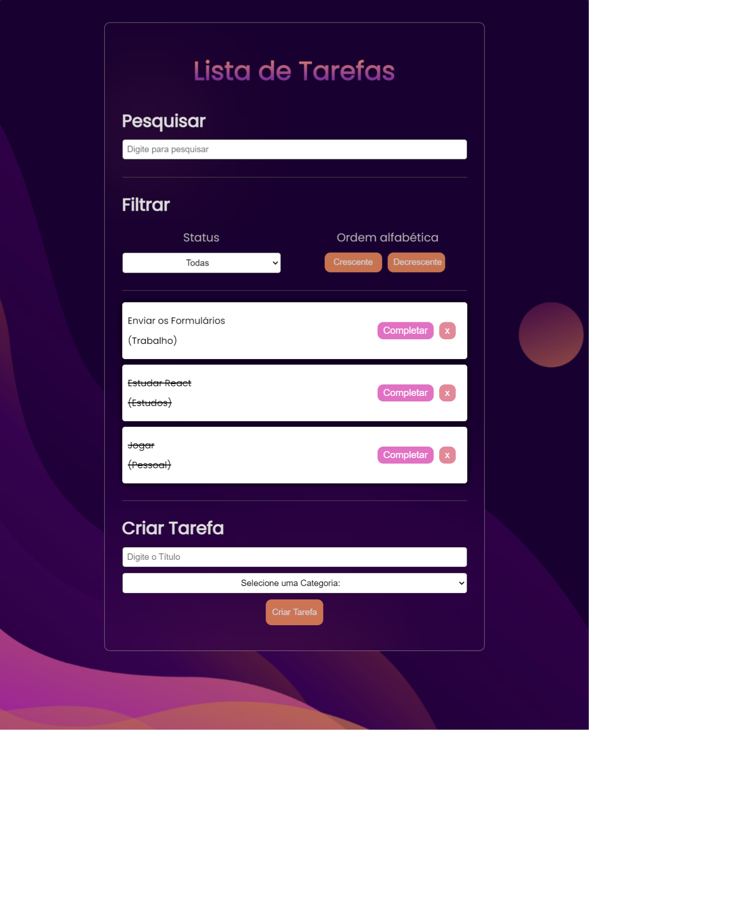

# Todo List
O projeto foi desenvolvido utilizando React se trata de uma aplicação de lista de tarefas com design responsivo. Utiliza localStorage para persistência local, permitindo adição, remoção, conclusão, filtragem e pesquisa de tarefas. Possui uma interface moderna e amigável, demonstrando habilidades em React e estilos CSS. Desenvolvido 100% como forma de estudo.

## Principais Componentes:

* App: O componente principal que gerencia o estado global da aplicação, incluindo as tarefas, filtros e opções de ordenação. Ele renderiza os componentes TodoForm, Search, Filter e a lista de Todo.

* TodoForm: Um formulário para adicionar novas tarefas à lista. Inclui campos para o título da tarefa e a categoria.

* Search: Um componente para permitir que o usuário pesquise tarefas com base em um texto inserido.

* Filter: Oferece opções para filtrar as tarefas por status (completo, incompleto) e ordenar por ordem alfabética.

* Todo: Representa individualmente cada tarefa na lista, com botões para completar ou remover a tarefa.

# Link para a Página

Link: 

# Screenshot
Prévia do projeto :

